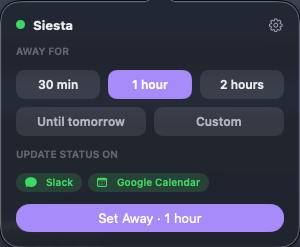
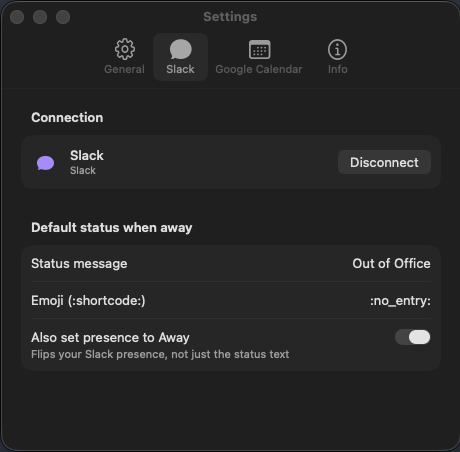

# Siesta

A macOS menu bar app that pauses your Slack status and Google Calendar availability while you're away, and restores them when you're back.

<p align="center">
  
  
</p>

## Features

- Lives in the menu bar. No dock icon, no windows to manage.
- One click (or a timer) to go "away": sets a custom Slack status and blocks out a busy event on Google Calendar
- Restores your previous status when you return, or after the away period ends
- Sign-in via OAuth 2.0, tokens stored in the Keychain

## Installation

```
brew tap abgeo/tap
brew install siesta
```

This build isn't notarized (no paid Apple Developer account behind it yet), so on first launch macOS will flag it as from an unidentified developer.
Installing via Homebrew works around this automatically; if you download the app some other way, right-click it and choose Open once to bypass Gatekeeper.

## Setup

1. Clone the repo and open `Siesta.xcodeproj` in Xcode.
2. Create your local OIDC config from the template:
   ```
   cp Siesta/Auth/Config/OIDCConfig.example.plist Siesta/Auth/Config/OIDCConfig.plist
   ```
3. Fill in `clientID` for each provider (Slack, Google) from their developer consoles. These are public-client identifiers, no secret required.
4. Build and run (`⌘R`). Xcode will resolve Swift Package dependencies on first build.

## Linting

SwiftLint runs automatically as a build-tool plugin using the rules in `.swiftlint.yml`; warnings show up inline in Xcode alongside compiler diagnostics.
